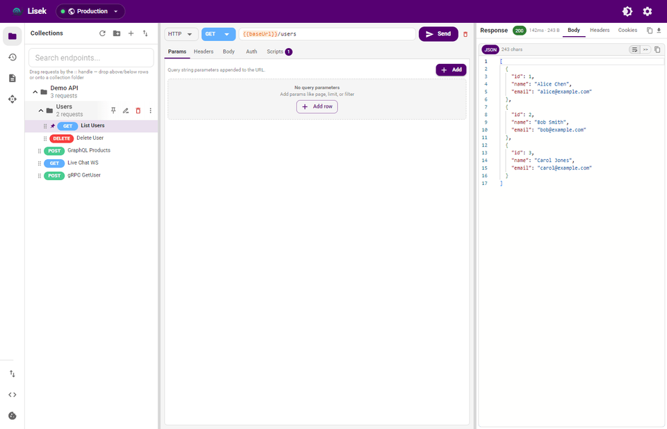
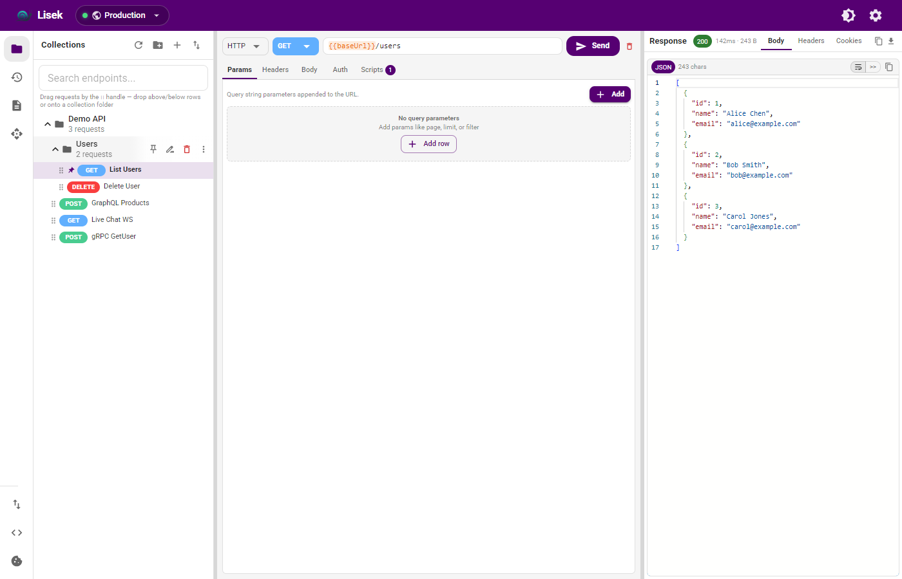
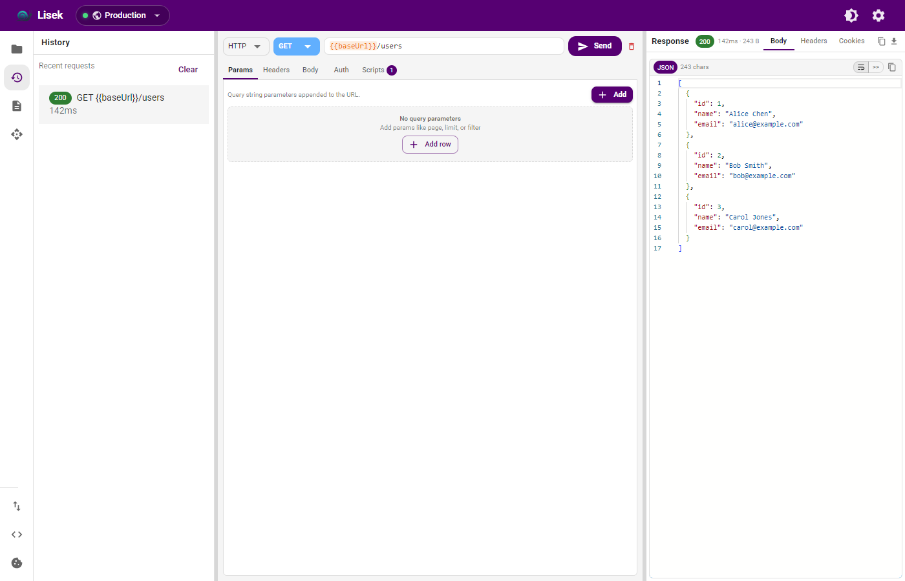
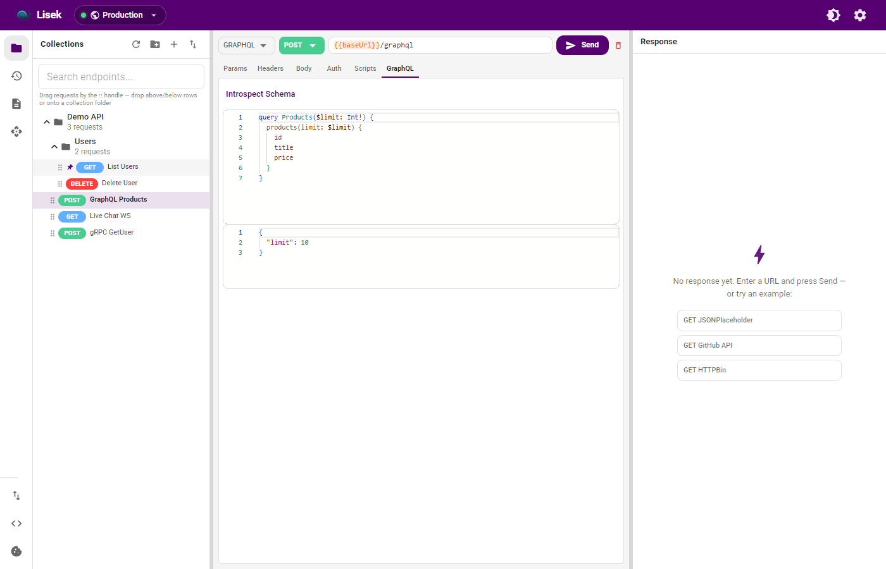
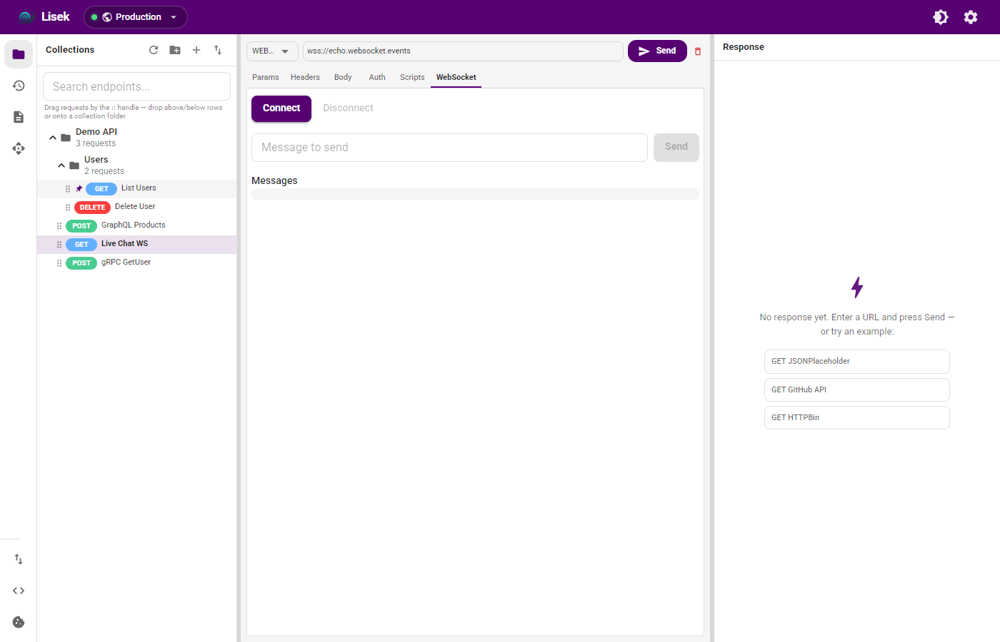
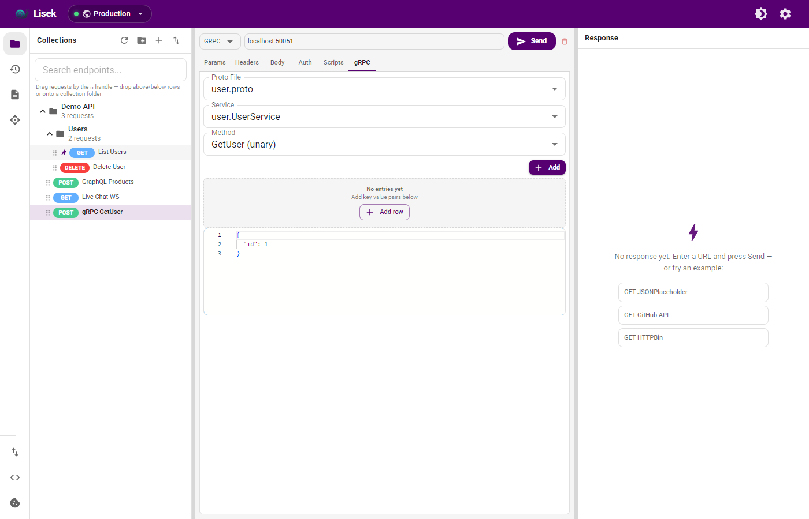
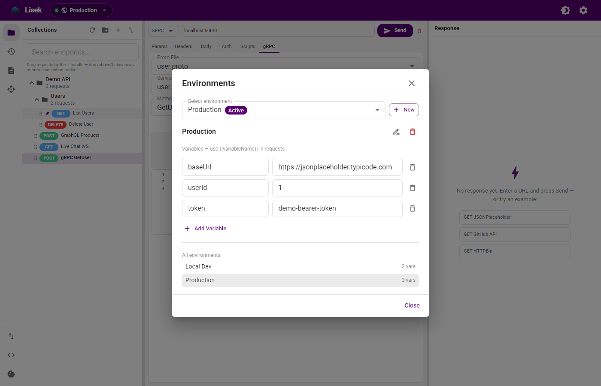
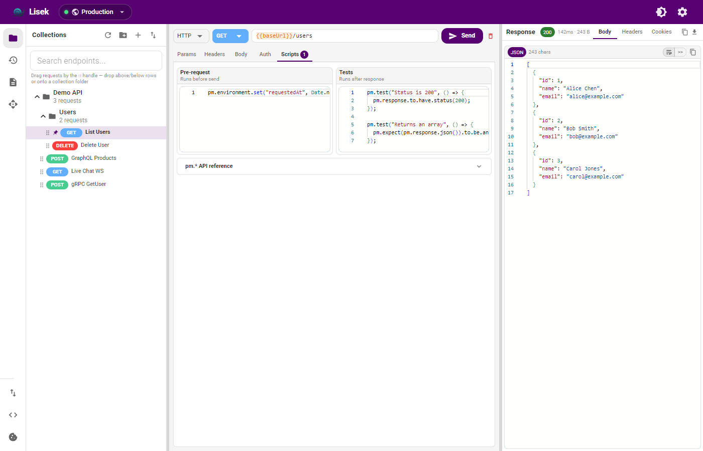
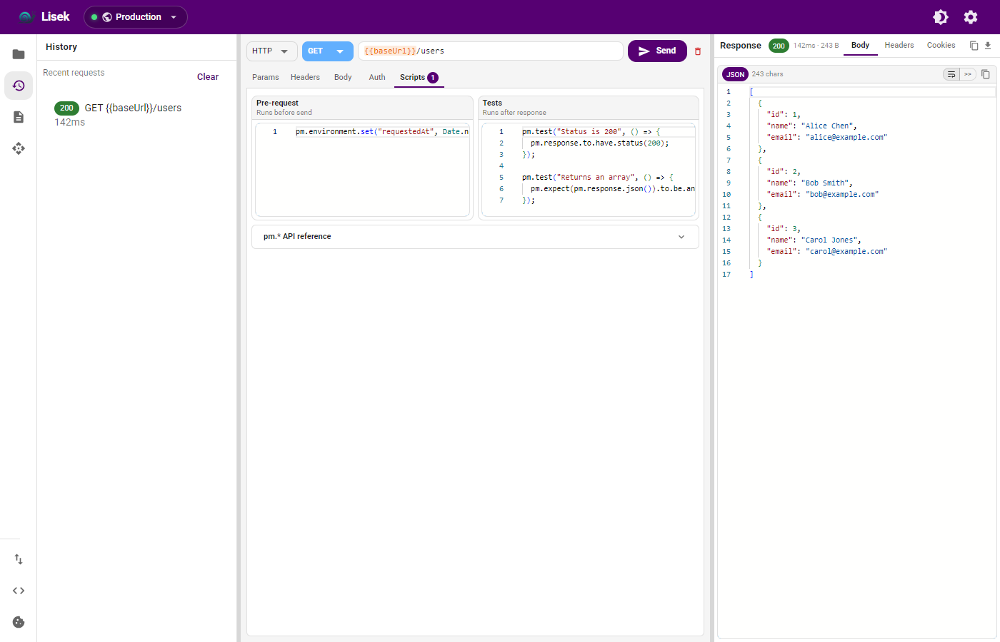

# Lisek

Offline desktop API client for **HTTP**, **GraphQL**, **WebSocket**, **SSE**, and **gRPC**. Built with Electron, React, MUI, and SQLite — no cloud account required.

**Website:** [mortenaho.github.io/Lisek](https://mortenaho.github.io/Lisek)

**Download:** [Windows installer](https://github.com/mortenaho/Lisek/releases/latest/download/Lisek-Setup.exe) · [Linux AppImage](https://github.com/mortenaho/Lisek/releases/latest/download/Lisek.AppImage) · [Linux RPM](https://github.com/mortenaho/Lisek/releases/latest/download/Lisek.rpm) · [All releases](https://github.com/mortenaho/Lisek/releases/latest)



## Screenshots

| Collections | HTTP / REST |
|-------------|-------------|
|  |  |

| GraphQL | WebSocket |
|---------|-----------|
|  |  |

| gRPC | Environments |
|------|--------------|
|  |  |

| Scripts | History |
|---------|---------|
|  |  |

---

## Features

### HTTP Requests

- All standard methods: **GET**, **POST**, **PUT**, **PATCH**, **DELETE**, **HEAD**, **OPTIONS**
- **Query params**, **headers**, and **body** editors with per-row enable/disable
- Body modes: **none**, **raw** (JSON/XML/text), **form-data** (with file upload), **x-www-form-urlencoded**
- **Cancel** in-flight requests · **auto-save** on Send · `Ctrl+Enter` to send
- **SSL verification**, **follow redirects**, **proxy**, and **timeout** settings
- Automatic **cookie jar** with domain management UI
- **Tags** and **notes** per request for organization

### Authentication

- **Bearer**, **Basic**, **API Key** (header or query), **OAuth 2.0** (client credentials & password grants)

### Variables

- **Environment** and **collection** variables with `{{variable}}` substitution
- Autocomplete in URL and body fields
- Script API: `pm.environment.*`, `pm.collectionVariables.*`

### Collections & Runner

- Nested folders, pinning, search, collection variables
- **Collection Runner** with CSV/JSON data files, pre-request/test scripts, stop-on-failure
- **Scheduled requests** — run a saved request on a cron-like interval with desktop notifications
- **Git folder sync** — link a collection to a folder, push/pull JSON, optional file watcher
- Export: **Postman**, **OpenAPI 3**, **Bruno**
- Import: **Postman**, **OpenAPI/Swagger**, **Insomnia**, **Bruno**, **HAR**, **cURL**

### Response Viewer

- Monaco editor with syntax highlighting, JSONPath query, word wrap
- **Image / PDF preview** for binary responses
- **Response diff** against saved snapshots
- Copy, download (text or binary), headers, cookies, tests, script console

### OpenAPI / Swagger

- Import from file or URL, browse paths, generate requests
- **Create environment** from spec (base URL + common variables)

### GraphQL

- Query/variables editors, schema introspection, field insertion
- **GraphQL subscriptions** over WebSocket

### WebSocket & SSE

- WebSocket client with live message log
- **Server-Sent Events (SSE)** connection panel

### gRPC

- Import `.proto` from disk or **URL**, service/method picker
- Unary and streaming call types, metadata, JSON payload
- **gRPC server reflection** browser

### Local Mock Server

Built-in HTTP stub server for local development:

- Add routes with method, path, status code, and response body
- Response types: **JSON** (auto-beautify), **text**, or **file** (PDF, images, etc.)
- Edit, delete, and copy route URLs from the UI
- **Live indicator** on the icon rail when the server is running
- Serves files with correct `Content-Type`; open in browser or force download

### Plugins

Sidebar tools for everyday API work (no request required):

| Plugin | Purpose |
|--------|---------|
| Base64 | Encode / decode |
| URL Encode | Encode / decode URL strings |
| Hash | SHA-256, SHA-384, SHA-512 |
| JWT Decode | Inspect header & payload |
| Crypto | AES-GCM / AES-CBC encrypt & decrypt |

### Scripts

Postman-compatible **`pm.*`** sandbox: environment/collection vars, `pm.test`, `pm.expect`, `console.log`.

### History

- Reopen any past request/response snapshot from the History panel

### Help & updates

- In-app **Help** guide (`F1` or the ? button) covering the whole workspace
- Optional notification when a newer GitHub release is available

### Import & Export

| Format | Import | Export |
|--------|--------|--------|
| Postman Collection v2.1 | ✓ | ✓ |
| OpenAPI 3 / Swagger 2 | ✓ | ✓ |
| Insomnia | ✓ | — |
| Bruno | ✓ | ✓ |
| HAR | ✓ | ✓ |
| cURL | ✓ (paste) | ✓ (snippet dialog) |
| Workspace backup (JSON) | ✓ | ✓ |

### Settings & UI

- Light / dark theme, resizable sidebar and response panel
- Icon rail: Collections, History, OpenAPI, Proto, Plugins, Import, cURL, Cookies, **Mock Server**
- Command palette, keyboard shortcuts, fully offline (bundled fonts & icons)

---

## Tech Stack

| Layer | Technology |
|-------|------------|
| Desktop | Electron 34 |
| UI | React 19, MUI 6, Monaco Editor |
| Build | electron-vite, electron-builder |
| Storage | SQLite via sql.js |
| HTTP | undici |
| gRPC | @grpc/grpc-js, @grpc/proto-loader |

---

## Development

```bash
npm install
npm run dev
```

```bash
npm run build      # production build
npm run typecheck  # TypeScript check
npm test           # Vitest unit tests
npm run screenshots  # regenerate docs screenshots
npm run icons      # regenerate app icons
```

---

## Build Windows Installer

Close any running Lisek instance, then:

```bash
npm run dist
```

Output is copied to `dist-installer/` (see `scripts/post-dist.mjs`).

---

## GitHub Pages

Static site in [`docs/`](docs/index.html) — deployed via [`.github/workflows/pages.yml`](.github/workflows/pages.yml).

Live at **https://mortenaho.github.io/Lisek/**

---

## Releases

Push a version tag to trigger the Windows + Linux build workflow:

```bash
git tag v1.6.4
git push origin v1.6.4
```

Or run **Actions → Release → Run workflow** with the tag name.

---

## Data Storage

Local SQLite database and assets:

```
%APPDATA%/Lisek/
  lisek.db          # collections, requests, environments, history, …
  cookies.json      # cookie jar
  mock-routes.json  # mock server routes
  mock-assets/      # files staged for mock responses
  protos/           # imported .proto files
```

---

## Project Structure

```
src/
  main/           Electron main process, IPC, services, SQLite
  preload/        Secure IPC bridge
  renderer/       React + MUI UI
    features/     collections, request, response, mock server, plugins, …
    stores/       Zustand app state
shared/           Shared TypeScript types
docs/             GitHub Pages site & screenshots
tests/            Vitest unit tests
```

---

## License

MIT — see [package.json](package.json).
