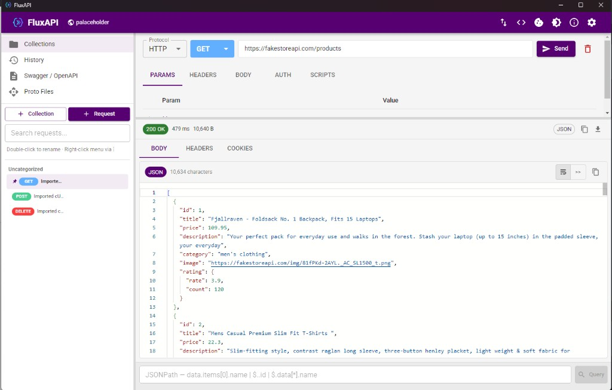
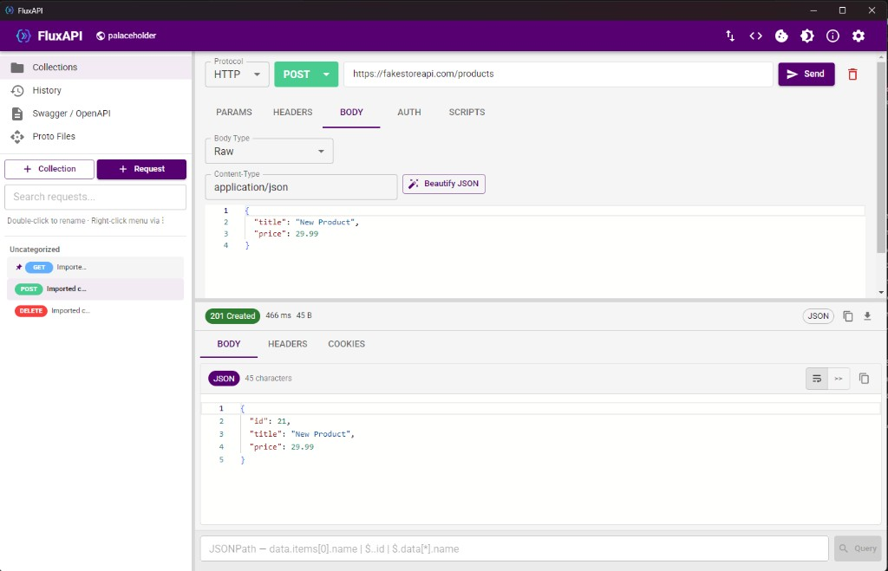
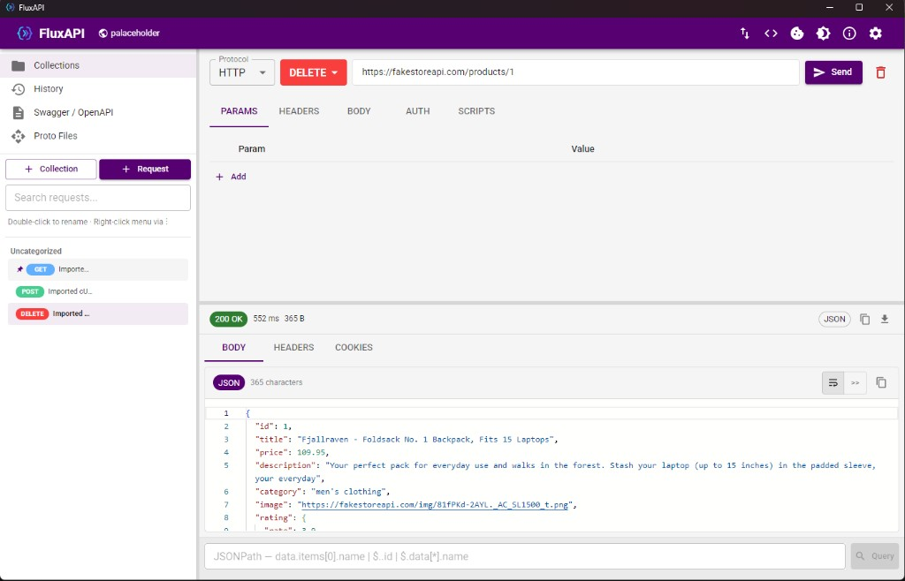
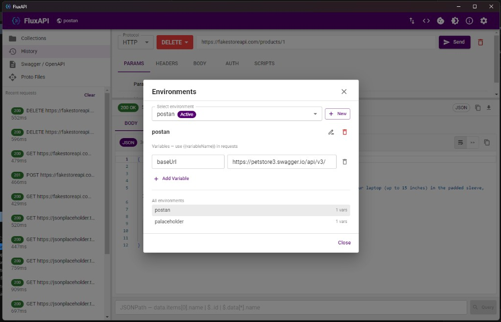

# FluxAPI

Offline desktop API client for **HTTP**, **GraphQL**, **WebSocket**, and **gRPC**. Built with Electron, React, MUI, and SQLite — no cloud account required.

## Screenshots

### GET — list products



### POST — create a product



### DELETE — remove a product



### Environments — manage variables



---

## Features

### HTTP Requests

- All standard methods: **GET**, **POST**, **PUT**, **PATCH**, **DELETE**, **HEAD**, **OPTIONS**
- **Query params**, **headers**, and **body** editors with per-row enable/disable
- Body modes:
  - **None**
  - **Raw** (JSON, XML, plain text, etc.) with content-type selector and one-click JSON formatting
  - **form-data** with **file upload** support
  - **x-www-form-urlencoded**
- **Cancel** an in-flight request
- **Auto-save** the active request when you click Send
- **Keyboard shortcut:** `Ctrl+Enter` to send
- Configurable **SSL certificate verification**, **follow redirects**, and **request timeout**
- Automatic **cookie jar** — cookies from responses are stored and sent on matching domains

### Authentication

- **No Auth**
- **Bearer Token**
- **Basic Auth** (username / password)
- **API Key** (header or query parameter)
- **OAuth 2.0**
  - Client Credentials grant
  - Password grant
  - Auto token fetch from token URL, or paste an access token manually

### Variables

- **Environment variables** — multiple environments, one active at a time
- **Collection variables** — scoped to a collection and its sub-folders
- `{{variable}}` substitution in URL, params, headers, body, and auth fields
- Autocomplete picker for environment and collection variables in the URL bar
- Scripts can read/write environment and collection variables; changes are persisted

### Collections & Requests

- Organize requests in **nested folders**
- Create, rename, duplicate, delete collections and requests
- **Pin** collections and requests to the top
- Search/filter in the collections sidebar
- **Collection variables** editor (per collection)
- **Export** a collection as **Postman Collection v2.1** or **OpenAPI 3**
- **Collection Runner** — run all HTTP/GraphQL requests in a folder sequentially
  - Executes pre-request and test scripts
  - Runs test assertions
  - Optional **stop on first failure**
  - Pass/fail summary with status codes and duration

### Response Viewer

- **Body** tab with Monaco editor — syntax highlighting for JSON, XML, HTML, and more
- Pretty-printed JSON; toggle **word wrap**
- **Copy body**, **copy full response**, **download response** (JSON or plain text)
- **Headers** and **Cookies** tabs
- **Tests** tab when test scripts ran (pass/fail per assertion)
- **JSONPath query** on JSON responses — e.g. `$.data.items[0].name`, `$..id`
- Status code chip, response time, and size in the toolbar

### Import & Export

| Format | Import | Export |
|--------|--------|--------|
| Postman Collection v2.1 (JSON) | ✓ | ✓ |
| OpenAPI 3 / Swagger 2 (JSON, YAML) | ✓ | ✓ |
| cURL command | ✓ (paste) | ✓ (code snippet dialog) |

### OpenAPI / Swagger Browser

- Import and browse imported specs in the sidebar
- Expand a spec to see all **paths and methods**
- **Generate a request** from any operation with one click

### GraphQL

- Dedicated GraphQL protocol mode
- Query and variables editors
- **Schema introspection** — browse types and fields
- Click a field to insert it into the query

### WebSocket

- Connect to `ws://` or `wss://` endpoints
- Custom headers on connect
- Send messages and view a live **sent/received** log
- Connect / disconnect controls

### gRPC

- Import **`.proto`** files (stored locally, reusable across requests)
- Pick **service** and **method** from the loaded proto
- Call types: **unary**, **server streaming**, **client streaming**, **bidirectional streaming**
- Metadata headers and JSON message payload
- Target host (e.g. `localhost:50051`)

### Pre-request & Test Scripts

Postman-compatible **`pm.*`** API in a sandboxed VM:

| API | Description |
|-----|-------------|
| `pm.environment.set/get/unset` | Read/write active environment variables |
| `pm.collectionVariables.set/get/unset` | Read/write collection variables |
| `pm.variables.set/get` | Alias for environment variables |
| `pm.request` | Current request method, URL, headers, body |
| `pm.response` | Status, headers, `text()`, `json()` (test phase only) |
| `pm.test(name, fn)` | Define a test assertion |
| `pm.expect(actual).to.equal/eql/be.ok` | Chai-style assertions |
| `console.log` | Captured script output |

Pre-request scripts can modify the outgoing request. Test scripts run after the response and produce pass/fail results shown in the response panel.

### History

- Automatic log of sent requests with status code and duration
- Click any entry to reopen the request/response snapshot
- Clear all history

### Cookie Jar UI

- View all stored cookies grouped by **domain**
- Delete cookies for a single domain
- **Clear all** cookies

### Settings & UI

- **Light / Dark** theme (toolbar toggle or Settings)
- **Resizable** sidebar width and response panel height (persisted)
- Sidebar panels: Collections, History, Swagger/OpenAPI, Proto Files
- Toolbar: Environments, Import, cURL snippet, Cookie jar, Theme, About, Settings
- Fully **offline** — bundled Roboto fonts and MUI icons (no CDN)

---

## Tech Stack

| Layer | Technology |
|-------|------------|
| Desktop shell | Electron 34 |
| UI | React 19, MUI 6, Monaco Editor |
| Build | electron-vite, electron-builder |
| Storage | SQLite via sql.js (pure JS, no native DB build) |
| HTTP | undici (Node fetch) |
| gRPC | @grpc/grpc-js, @grpc/proto-loader |

---

## Development

```bash
npm install
npm run dev
```

Other scripts:

```bash
npm run build      # production build
npm run typecheck  # TypeScript check
npm test           # Vitest unit tests
npm run icons      # regenerate app icons
```

---

## Build Windows Installer

Close any running FluxAPI/Electron instance first, then:

```bash
npm run dist
```

Output: `dist-installer/FluxAPI Setup 1.1.0.exe`

The build writes to a temp directory and copies the installer into `dist-installer/` via `scripts/post-dist.mjs`.

---

## Data Storage

All data is stored locally in a SQLite database:

```
%APPDATA%/FluxAPI/fluxapi.db
```

Stored data includes collections, requests, environments, history, imported proto files, OpenAPI specs, settings, and the cookie jar.

---

## Project Structure

```
src/
  main/           Electron main process, IPC handlers, services, SQLite
  preload/        Secure IPC bridge (contextBridge)
  renderer/       React + MUI UI
    features/     Collections, request builder, response, import, settings, …
    components/   Shared UI (editors, dialogs, resize handles)
    stores/       Zustand app state
shared/           Shared TypeScript types and app metadata
resources/        Icons and logo assets
scripts/          Build helpers (icons, dist, electron branding)
tests/            Vitest unit tests
```

---

## License

MIT — see [package.json](package.json).
